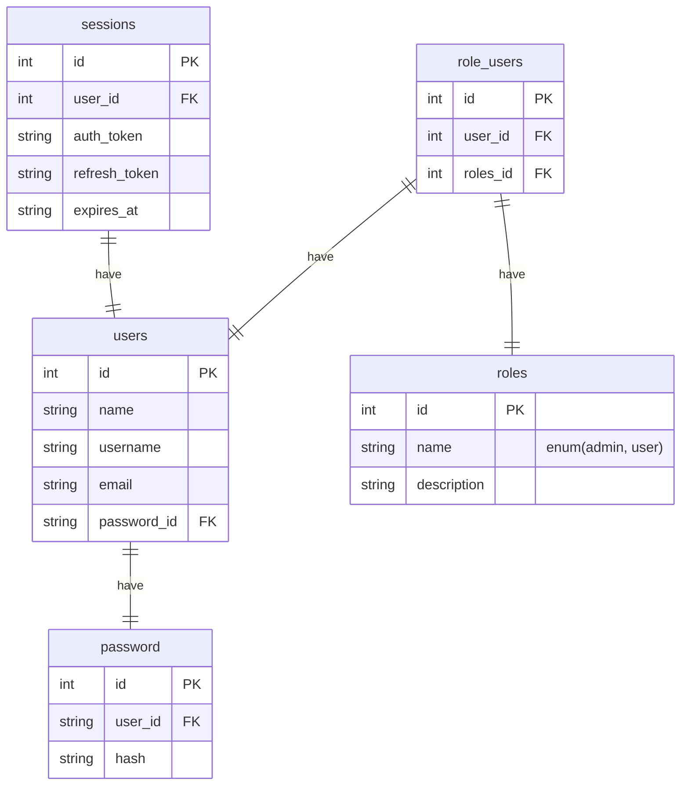

# Authentication Flow

```mermaid

erDiagram
    users {
        int id PK
        string name
        string username
        string email
        string password_id FK
    }

    password {
        int id PK
        string user_id FK
        string hash
    }
    users ||--|| password: have

    roles {
        int id PK
        string name "enum(admin, user)"
        string description
    }

    role_users {
        int id PK
        int user_id FK
        int roles_id FK
    }

    role_users ||--|| users: have
    role_users ||--|| roles: have

    sessions {
        int id PK
        int user_id FK
        string auth_token
        string refresh_token
        string expires_at
    }

    sessions ||--|| users: have


```
