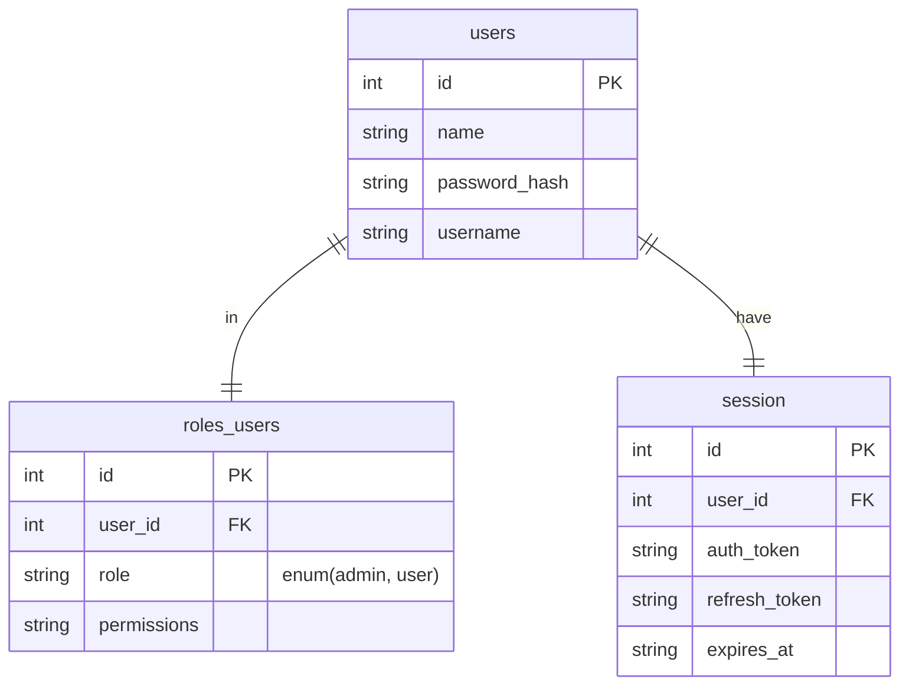

# Authentication Flow

```mermaid

erDiagram
    users {
        int id PK
        string name
        string password_hash
        string username
    }

    roles_users {
        int id PK
        int user_id FK
        string role "enum(admin, user)"
        string permissions
    }

    session {
        int id PK
        int user_id FK
        string auth_token
        string refresh_token
        string expires_at
    }

    users ||--|| roles_users: in
    users ||--|| session: have


```
